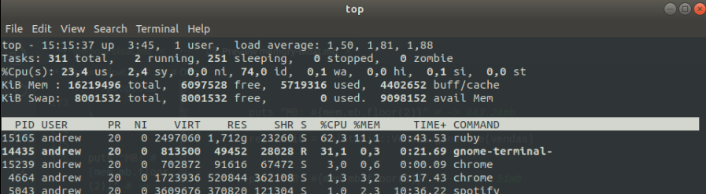

# Otimizando o uso de memória dos workers de nossa aplicação rails, parte 2

Na primeira parte deste artigo falamos um pouco sobre o que me levou a escrever este artigo e como o ruby manuseia a memória para alocar seus objetos. Nessa segunda parte entro mais adentro sobre os problemas de memória que tivemos, ferramentas e como tirar métricas.

## O que não me trouxe resultados

Prefiro já adiantar e fazer com que você perca menos tempo lendo este artigo caso esteja buscando alguma dessas soluções nele:

### Jemalloc

De principal, ao compilar usando jemalloc pode gerar algus erros na sua aplicação, primeiro verifique se não é erro ou alguma melhoria que pode ser aplicada ao código antes, na maioria dos casos, arrumar o código vai resolver os problemas.

- Não são apenas 3 passos para instalar, os únicos guias encontrados, eram 3 passos para instalar o jemalloc. This is a bullshit.

- Não se encontra muito conteúdo e guias sobre isso

### Variável mágica MALLOC_ARENA_MAX

Setando a váriavel `MALLOC_ARENA_MAX=2` para mim não trouxe resultado algum, os resultados continuavam a apontar praticamente o mesmo número de objetos alocados e de quantidade de memória utilizados

### Altereções das varáveis do GC

Não obtive resultados satisfatorios com alterações das váriaveis do gc. Setar a *variável mágica* fazia com que o número de objetos alocados e quantidade de memoria continuassem praticamente os mesmos e ainda fazia o tempo de execução ficar menor.

Uma coisa que mostrou pouco resultado liberando memória(liberando incríveis 50mb de 1.8gb), foi colocar o comando `GC.start` a cada iteração. Em contrapartida dobrava o tempo de execução do algoritimo.

Você pode tentar algumas alterações como as deste link aqui: [Tuning the GC](https://collectiveidea.com/blog/archives/2015/02/19/optimizing-rails-for-memory-usage-part-2-tuning-the-gc)

Talvez funcione melhor para o seu caso. Good luck have fun!

## Analisando e medindo o uso de memória

Nosso primeiro objetivo quando vamos analisar por problemas de memória na nossa aplicação é buscar por ferramentas que nos tragam um norte, criando assim métricas e mostrando mais afundo quais arquivos, classes, gems, objetos e módulos estão alocando essa memória.

### Ferramentas usadas para criar analises e métricas da memória

  - [gem 'get_process_mem'](https://github.com/schneems/get_process_mem) para pegar o uso de memoria de um processo. Basicamente ele nos diz o quanto de memoria está sendo usada naquele momento(o que o ruby sabe que está sendo usado)
  - [gem 'memory_profiler'](https://github.com/SamSaffron/memory_profiler) para mostrar a quantidade de objetos alocados, retidos, quais arquivos estavam criando mais objetos e muito mais.
  - [gem 'derailed_benchmarks'](https://github.com/schneems/derailed_benchmarks) para mostrar o quando as gems estavam utilizando de memoria

  - O comando `top` que mostra os processos do linux, basicamente usamos ele para verificar a quantidade de memoria que o ruby está usando de "verdade" na nossa máquina. Usamos para visualizar a nivel de kernel o quando de memória está em uso.

### Analisando e criando métricas

Nós já possuimos as ferramentas necessárias para começar a nossa análise de memória, agora é por a mão na massa.

A primeira coisa que usei foi o derailed benchmarks, eu queria ver se havia alguma gem que estava consumindo muita memória ao iniciar a aplicação:

```bash
bundle exec derailed bundle:mem
```

Rodando o comando acima em seu terminal ele vai dar um require nas gems presentes no seu projeto e te mostrar o quanto de memória foi gasto para fazer o carregamento de cada uma das gems. Veja o resultado abaixo:


No meu caso, 109.49mb para um projeto grande estava de bom tamanho, ainda não era o que eu buscava, mas caso você note que tem alguma gem que está usando mais memória do que deveria talvez seja interessante botar o seu gemfile em uma dieta.

O meu passo seguinte foi utilizar a gem memory_profiler. É a partir daqui que as coisas começaram a ficar interessantes.

Iniciando o meu rails console e inserindo o seguinte script que é responsavel por gerar os dados do relatório obtive os seguintes resultados:

```Ruby

ransack_params = {}

require 'memory_profiler'

report = MemoryProfiler.report do
  vendas = Venda.ransack(ransack_params).result
                .includes(
                  { nota: :comprador },
                  { nota: :vendedor },
                  :cliente,
                  :proposta
                )

  relatorio = Relatorio::Vendas.generate(vendas)
end

report.pretty_print(scale_bytes: true)
```


Com apenas 1/3 das vendas na plataforma, o equivalente a 36.964, tivemos um total de 2.27gb de uso da nossa memória, 28.379.965 objetos foram alocados. Tinhamos mantido 480.63(mb) de memória, o equivalente à 3.605.395 objetos, que seriam utilizados para fazer a escrita dos dados no arquivo.

Esses detalhes são interessantes mas não suficientes, eu sabia que tinhamos utilizado 2.27gb de memória mas não sabia o ápice do uso dessa memória, e é ai que entra nossa outra gem `get_process_mem` que mostra exatamente o valor de memória que está sendo usado pelo ruby no exato instante

```Ruby

mem = GetProcessMem.new

ransack_params = {}

puts "MB: #{mem.mb.floor(2)}" # -> 219.73mb

vendas = Venda.ransack(ransack_params).result
              .includes(
                { nota: :comprador },
                { nota: :vendedor },
                :cliente,
                :proposta
              )


puts "MB: #{mem.mb.floor(2)}" # -> 443.24mb

relatorio = Relatorio::Vendas.generate(vendas)


puts "MB: #{mem.mb.floor(2)}" # -> 1336.51mb
```

Usando o objeto `GetProcessMem` conseguimos obter que o valor de mb ao iniciar nossa aplicação é de aproximadamente 219.73mb, que logo ao fazer a query, essa memória crescia para 443.24mb e que ao fazer o processamento dos dados essa memória em uso crescia para 1336.51mb o que é um crescimento grande e desnecessario já que não vamos utilizar grande parte dessa memória em uso.

Decidi ir mais a dentro e utilizar o objeto dentro do iterador que gera cada uma das rows do relatório e o resultado foi de `448.24mb` de memória até os `997.52mb` sómente dentro da iteração e após o retorno do relatorio foi para `1336.51mb`.

Isso é claro, estamos vendo ao nível que o ruby conhece sobre o uso de memória, foi então que decidi usar o comando `top` para ver o quando o S.O sabia sobre o uso de memória.



Observando os dados do relatório sendo gerados notei que o uso da memória aumenta gradativamente e essa memória não é liberada até o fim da criação/extração dos dados.

Fazendo uma simples regra de três, sem muita precisão, podemos notar que o sistema operacional reconhece cerca de 1.720 mb de memória utilizada pelo Ruby

```
(11.1 * 15.500) / 100 = 1.720 mb
```

Algumas observações importantes foram feitas com a analise:
- Uma grande quantidade de objetos estavam sendo criados
- O pico de uso de memória acontece dentro do iterador que gera os dados do relatório `997.52 - 448.24 = 549.28mb`
- A memória que já foi usada não estava sendo liberada para o S.O

Entendemos o como o ruby manuseia a memória e conseguimos descobrir alguns parâmetros iniciais. Agora com esses dados em mãos podemos começar a fazer algumas melhorias para diminuir o uso dessa memória. Faremos isso na terceira parte deste artigo. Vejo vocês lá!