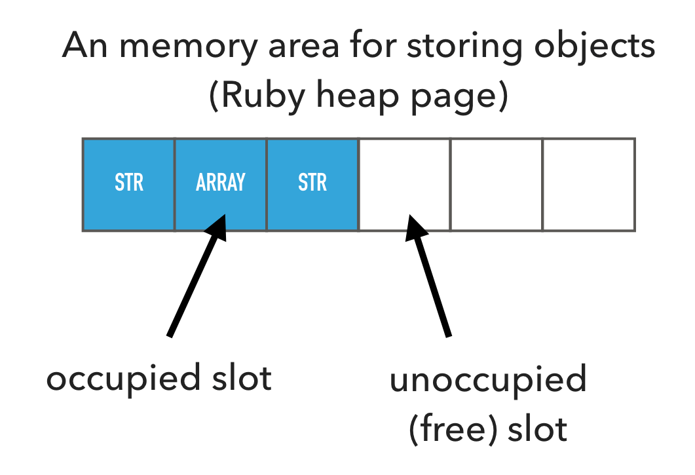
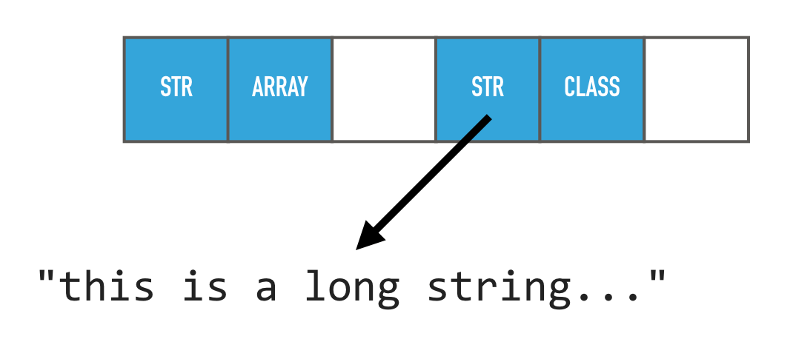
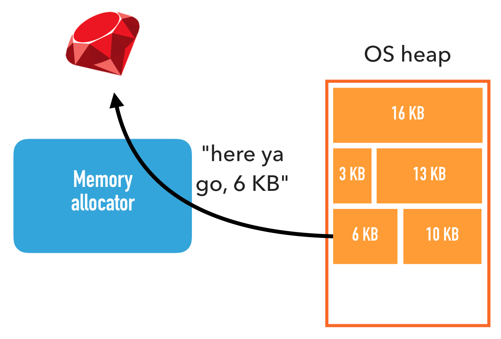
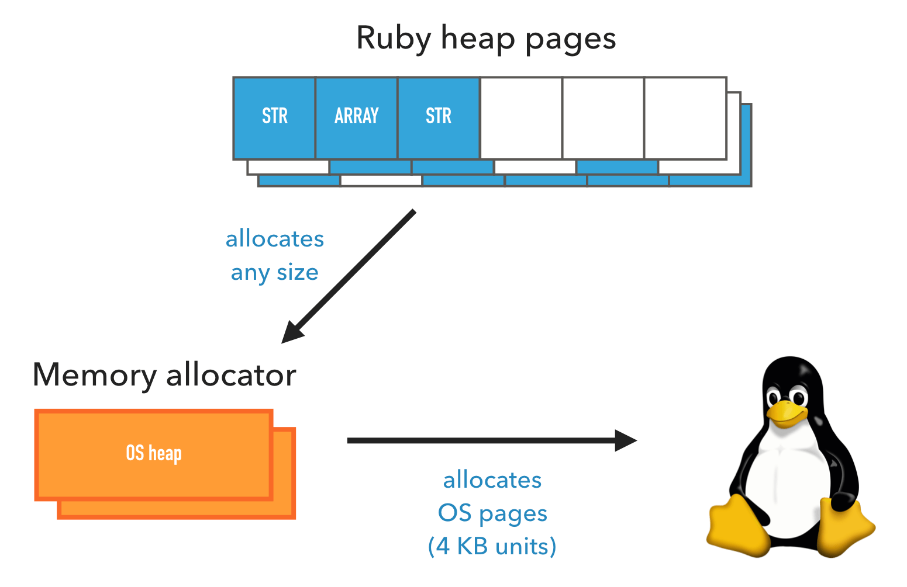
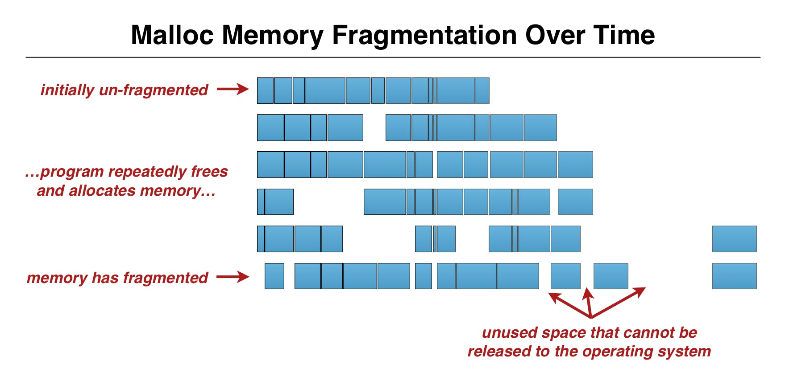
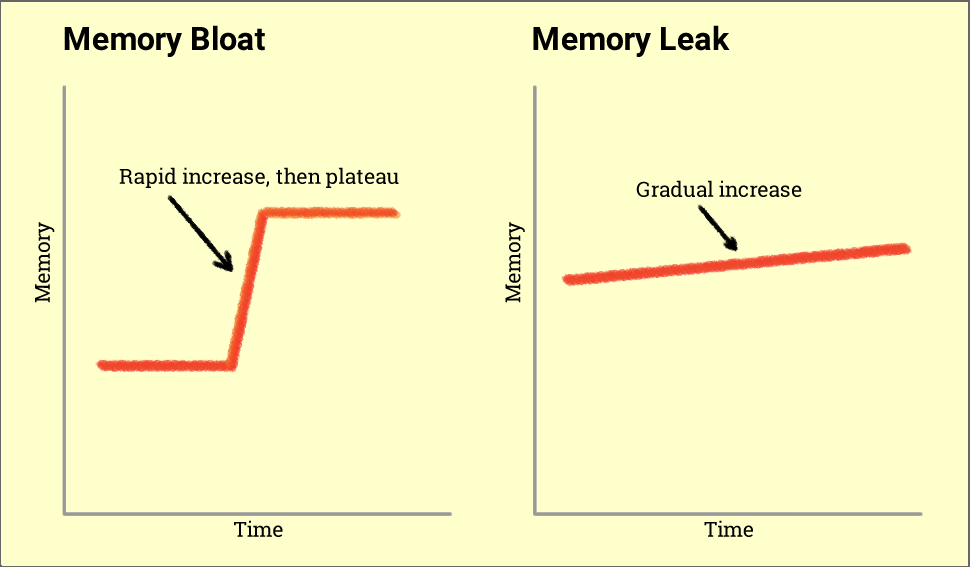

# Otimizando o uso de memória dos workers de nossa aplicação rails, parte 1

## Introdução, problematização

Somos uma startup com poucos anos de existência que desde o início estamos crescendo em  escala exponencial. E com essa escalabilidade, problemas de processamento e de memória começaram a surgir pela quantidade imensa de dados trafegados através dos nossos sistemas.

Recentemente tivemos alguns problemas de memória nos workers de relatórios de nossa aplicação que é desenvolvida com o framework Ruby On Rails. Estes workers utilizavam mais memória do que tinhamos disponível(512mb), o que tornava a geração de relatórios extremamente lenta e/ou impossível. Os workers estavam chegando a um pico de 1.8gb e poderiam chegar a 3.6gb de memória(considerando que o relatório gerado não tivesse qualquer filtro).

Para criar o relatório e ajudar nossos administradores acabamos por fazer duas coisas:

Baixamos o banco de produção e geramos na nossa máquina, com um processador intel i7 com 16 gb de ram e também reiniciamos os workers que estavam em uso e aumentamos a memória dos nossos workers para 2.5gb no heroku passando a pagar U$250,00 dólares/mês.

Eu, "leigo" que sou, com poucos anos de experiência e sem noção alguma em lidar com alocação de memória, muito menos com ruby, fui enviado para essa grande jornada de tentar resolver os problemas de memória de nosso relatório principal, e por meio deste artigo venho compartilhar minhas notas e experiências ao resolver o problema.

## Um pouco sobre alocação de memória no ruby

Quando comecei a analisar o problema, a primeira coisa que corri atrás foi de tentar entender como ocorre a alocação, manuseamento e liberação de memória no ruby, afinal não tinha idéia alguma de como isso ocorria. Aqui vão algumas notas a vocês:

### O que é o garbage collector(GC)

O gargabe collector cuida de alocar, ficar de olho no que está em uso e liberar a memória de volta para o sistema.

Ruby organiza os objetos na memória em áreas chamadas Ruby heap pages. Uma Ruby page é dividida em slotes de tamanhos iguais, onde cada objeto criado ocupa um destes slotes. Independente de ser uma string, um hash, um array, uma classe, vai ocupar um destes slotes.

Slotes em ruby heap page devem estar ou não ocupados. Quando Ruby aloca um novo objeto, primeiro ele tenta ocupar um slote livre. Se não houver slotes livres, então ele vai alocar uma nova heap page.

Um objeto ruby pode armazenar apenas uma limitada quantidade de dados, até 40 bytes em um sistema 64-bit. Todos os dados que não cabem em um objeto são dinamicamente alocados fora dos ruby heap, quando o objeto é "varrido" pelo GC, a memória é liberada.

### Sistema alocador de memória

O sistema alocador de memória é uma biblioteca que faz parte do glibc.

- Memoria é alocada chamando o malloc(tamanho)

- Memoria é liberada chamando o free(endereço de memória)

Diferente de ruby, que lida com slotes de tamanhos iguais a maior parte do tempo, o alocador de memória aloca tem de lidar com alocações de memória de qualquer tamanho.

Uma area de memoria alocada pelo alocador de memória pelo Kernel, é chamado de heap. Note que isto não tem nada a ver com ruby heap pages, então para manter claro, vou utilizar o termo OS heap.

O alocador de memória atribui partes de um heap do SO a seus próprios chamadores até não ter mais espaços livres, nesse caso o sistema alocador de memória aloca uma nova OS heap do kernel. Isso é similar ao como o ruby aloca objetos nas ruby heap pages.

A memória é alocada em multiplos níveis, e cada nivel aloca mais memória do que o necessário. Ruby heap pages podem ter slotes livres, e OS heaps podem ter spaços livres. Então quando perguntamos "Quanto de memória está em uso?" a resposta depende de qual nível estamos falando.

Podemos usar ferramentas como o comando `top` no ubuntu para medir o uso de memória do processo, ele nos diz o uso de memória do ponto de vista do kernel.

## Fragmentação de memória

Fragmentação de memória é quando as alocações de memória estão espalhadas por todo o lugar. O problema é que o sistema alocador de memória e o GC do ruby não conseguem liberar estes "espaços" de volta para o sistema opeacional. Ele só retorna para o sistema operacional quando os ruby heap pages e/ou os OS heap não estão mais em uso. O que faz com que problemas como `memory leak` e `memory bloat` ocorram.

### Memory bloat e memory leak

Memory bloat é um grande aumento no uso de memória durante a alocação de vários objetos. É um problema mais momentaneo que um memory leak, que é um devagar e continuo aumento no uso de memória que pode ser aliviado criando rotinas de reinicialização.

Nessa primeira parte falamos sobre o como o ruby manuseia a memória usada. Resumidamente o Garbage collector é quem cuida da alocação, manutenção e liberação de memória do Ruby. O sistema alocador de memória cuida de requisitar e liberar memoria do sistema operacional. Na próxima parte eu conto como analisamos a memória, tiramos métricas e mostro alguns dados.

Até a próxima, pessoal.

# old way results

file size 32.8 mb (csv)

22.7 % de 15.5 gb -> 3.518 mb usados para gerar um arquivo de 32.8 mb

9 min para gerar

# new way results

Json.parse vs to_json

### outras ferramentas não exploradas

- ferramentas
- o que olhar e como

## solução ou workaround em cima disso

# fontes

Entendendo o uso de memória no ruby:
[What causes ruby memory bloat](https://www.joyfulbikeshedding.com/blog/2019-03-14-what-causes-ruby-memory-bloat.html)

[Incremental Garbage Collection in Ruby 2.2](https://blog.heroku.com/incremental-gc)

[how does ruby garbage collection works](https://stackify.com/how-does-ruby-garbage-collection-work-a-simple-tutorial/)

[Video - What causes ruby memory bloat](https://vimeo.com/322007980)

[Garbage collection](https://ruby-hacking-guide.github.io/gc.html)

Optimizing Rails for memory usage:

- [Part 1: Before You Optimize](https://collectiveidea.com/blog/archives/2015/02/19/optimizing-rails-for-memory-usage-part-1-before-you-optimize)

- [Part 2: Tuning the GC](https://collectiveidea.com/blog/archives/2015/02/19/optimizing-rails-for-memory-usage-part-2-tuning-the-gc)

- [Part 3: Pluck and Database Laziness](https://collectiveidea.com/blog/archives/2015/03/05/optimizing-rails-for-memory-usage-part-3-pluck-and-database-laziness)

- [Part 4: Lazy JSON Generation and Final Thoughts](https://collectiveidea.com/blog/archives/2015/03/13/optimizing-rails-for-memory-usage-part-4-lazy-json-generation-and-final-thoughts)

[Hunting Down Memory Issues In Ruby: A Definitive Guide](https://www.toptal.com/ruby/hunting-ruby-memory-issues)

[Debugging memory bloat](https://book.scoutapm.com/memory-bloat.html)

[How ruby uses memory](https://www.schneems.com/2015/05/11/how-ruby-uses-memory.html)

[How ruby uses memory - video](https://www.youtube.com/watch?time_continue=2181&v=m2nj5sUE3hg)